# PPR Motif identification using Neural Network

## Overview  
This repository contains code and Keras model to run and deploy the Flask app **PPR Scan**, as well as resulting PPR annotations for [Arabidopsis thaliana Araport11](Athaliana_447_Araport11.protein.fa.gz), which is then mannully curated. The model have been pre-trained to recognize 11 variants of [PPR motif](http://onlinelibrary.wiley.com/doi/10.1111/tpj.13121/full#tpj13121-sec-0002) and TPR motif in given input sequences.

## Getting Started  
### Creating virtual environments for python with conda  
```bash
conda create -n dl -c anaconda python=3.6 numpy pandas matplotlib seaborn scikit-learn keras Flask gunicorn biopython jupyterlab 
sourace activate dl
```
### Setting up a local server  
```bash
git clone https://github.com/MolGen/pprscan.git
cd pprscan
python app.py
```
## Sequence logo of *Arabidopsis thaliana* PPR-like motif variants  
P    
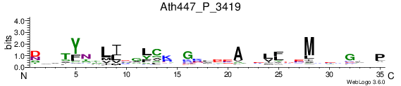  
P1   
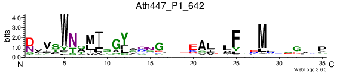  
P2   
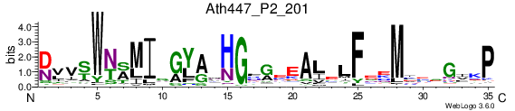  
L1   
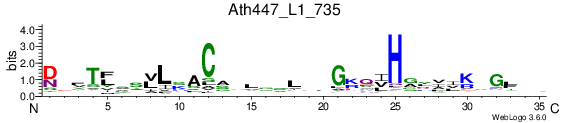  
L2   
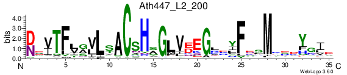  
S1   
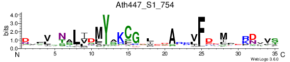  
S2   
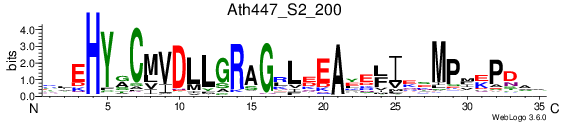  
SS   
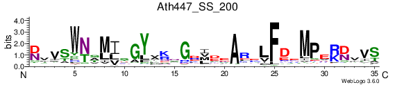  
TPR   
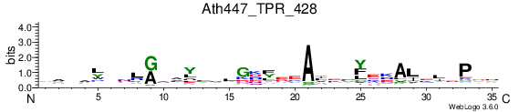  
E1   
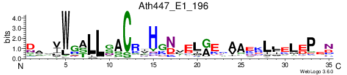  
E2   
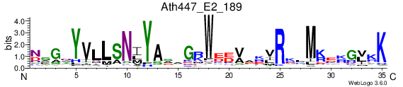  
